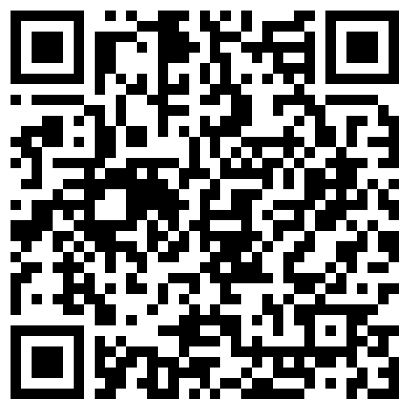

<!-- _class: lead -->

# Creating Digital Case Studies
## Workshop

**Dr. Robert Treharne**  
R.Treharne@liverpool.ac.uk

---

# Session Roadmap

1. Example, assignment requirements, and assessment weighting
2. AI guidance, MachinaViva, and platform choices
3. 4-part structure for a strong case study
4. Individual and pair activities
5. Common pitfalls, recap, and checklist

---

<!-- _class: tight -->

# Assignment Overview

## What students submit

- A **3-minute digital case study**
- A **500-word reflective commentary**
- **MachinaViva transcript**

## Assessment Breakdown

- This assessment is worth **60%** of the module
- **Digital artefact (video): 80%**
- **Reflective commentary: 20%**
- **Submission Deadline: Week 13 - 15th May**
- [View Assessment Rubric](#)

---

<!-- _class: tight -->

# Example Digital Case Studies

## Watch and observe

- [YouTube Playlist](https://www.youtube.com/watch?v=8c5ZN7BseNA&list=PLsWFiDvzgp8pkn5Wcdt2dneW4u1DpGZEA)

## As you watch, think:

- Who is the **target audience**?
- What is the **main message**?
- What makes it **clear or unclear**?

> Focus on clarity, not production quality.

---

<!-- _class: tight -->

# What is MachinaViva?

- A **Socratic AI tool** used to test and verify your understanding  
- You will be asked to **explain and justify your decisions**  
- It helps demonstrate **authentic understanding and ownership**  

## Why it matters

- Your transcript must be included in your submission  
- It supports your reflection and helps verify your work  
- Weak understanding becomes obvious here  

---

<!-- _class: tight -->

# Choose a Topic

- Vaccines, Therapeutics and Antimicrobial Resistance (AMR)
- Public Engagement in Science / Science Communication
- Health Inequality
- Threats to Biodiversity
- Climate Change and Global Food Security
- Sustainable Education Provision (Equity, Access, Continuity)
- Artificial Intelligence for Sustainable Innovation

---

<!-- _class: tight -->

# Choose an Audience

- Parents of young children
- Teenagers (13-18)
- University students (non-science background)
- Primary or secondary school students
- Patients with a specific condition (e.g. diabetes)
- People making lifestyle choices (diet, exercise)
- Local communities
- Consumers interested in sustainability
- Policymakers (non-scientific background)
- Any other, as long as you justify it

> Your audience must be specific enough that you can picture a real person.

---

<!-- _class: tight -->

# AI Use: What Is Allowed

## Allowed

- Brainstorming ideas
- Drafting script options
- Generating visuals

## Not allowed

- Writing the reflection
- Fake or shallow justification
- Replacing understanding
- Generated voiceovers or synthetic narration

> Over-reliance on AI is obvious in reflection and MachinaViva.

---

# Platforms (Any Is Fine)

- Canva
- CapCut
- PowerPoint
- iMovie
- Powtoon
- Any equivalent free tool

> The tool does not matter. Clarity does.
> You must learn your chosen tool yourself. We will not provide platform tutorials or guidance as part of this workshop.

**Don't subscribe!** Watermarks are fine, free versions are fine, no marks for polish alone.

---

<!-- _class: tight -->

# The 4-Part Flow

1. **Hook** - Why should I care?
2. **Explain** - What is the issue?
3. **Solution** - What can be done?
4. **Takeaway** - What should the audience think or do?

> Structure is your safety net.

---

<!-- _class: tight -->

# Example: Hook and Takeaway

## Topic
**Climate change and food security**

## Hook
"By 2050, climate change could reduce global crop yields by up to 30% — putting millions at risk of food shortages."

## Takeaway
"What you eat matters: choosing sustainable food options can help reduce pressure on global food systems."

> Clear, simple, and aimed at a non-expert audience.

---

<!-- _class: activity tight -->

# Individual Activity (10 - 12 min)

Students work independently to:

1. Choose a topic (from handbook)
2. Define a specific non-technical audience
3. Sketch:
   - Hook idea
   - Main message

> Test: Could your audience understand this in one viewing?

---

<!-- _class: activity tight -->

# Pair Activity (5 min)

Explain to a partner:

- Your topic
- Your audience
- Your core idea

Partner asks:

> "Would I understand this?"
> "What considerations might you need to make for your audience?"

---

<!-- _class: tight -->

# Common Pitfalls

- **No audience**
  "General public" is usually too vague

- **No structure**
  Feels like disconnected facts

- **Overuse of AI**
  Sounds polished but lacks depth

> Fix all three by defining audience + using the 4-part flow.

---

<!-- _class: final machina -->

# MachinaViva Task

## What to do
- Complete the example MachinaViva activity
- Answer MCQs
- Answer questions in your own words
- Download your transcript
- Use it to check your understanding of this assignment

## Access
<a class="mav-link" href="https://machinaviva.onrender.com/app/join/lRDptd1gz3z23ArvNcIZka1mXZW4PL-f/">Open MachinaViva</a>

Scan to open MachinaViva

> Once you've done this, you can go! Good Luck with your assignment!

> Any questions? Contact me directly via Microsoft Teams chat (better than email).
